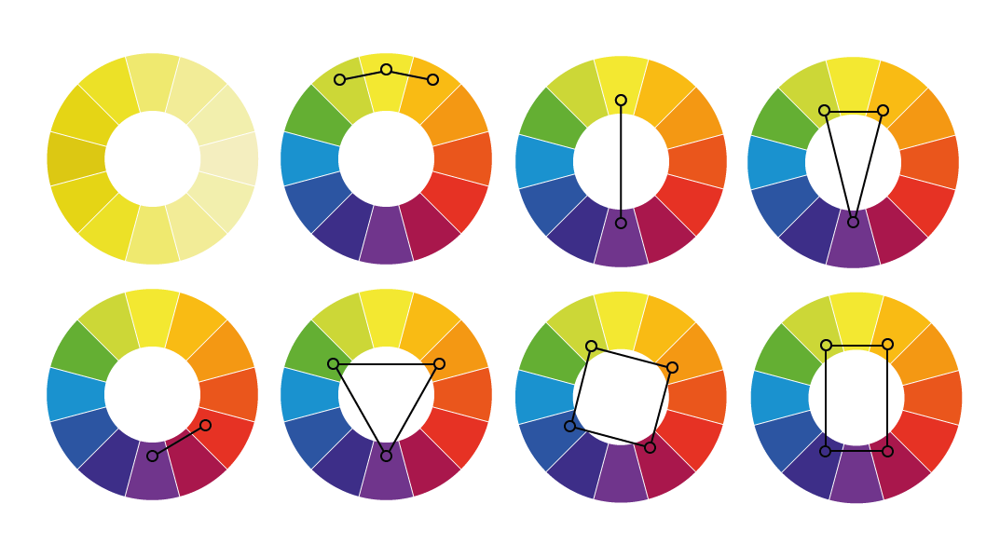
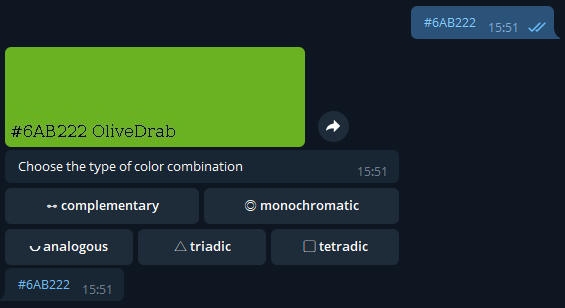
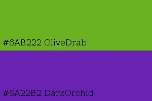
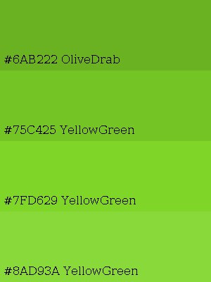
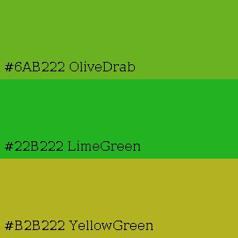
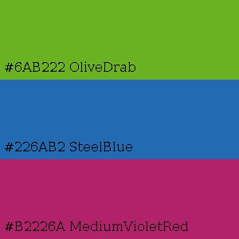
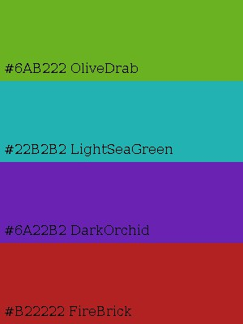

## Сolor palette helper 

A bot for generating color palettes. An analogue of the online services of the Itten's color wheel

#### Project objectives:
Develop a telegram bot using several third-party APIs.
Implement InlineKeyboardMarkup, logging, auto-reconnection.
Place the bot on the linux(raspbian) server using PM2(advanced, production process manager for node.js)

#### What can the bot do?
1. accepts a hex code and generates a colored rectangle with the name of the color
  
2. generates the following color palettes based on the resulting hex code:
   - Complementary color palettes are formed by using two colors on opposite sides of the color wheel. They are great for conveying a sense of balance.
   
     
   - Monochromatic color schemes consist of different shades and depths of the same color. In such schemes, all colors are derived from a single color.
   
     
   - Analogous are created by pairing one color with two others on either side of it on the color wheel. These palettes express uniformity and consistency.
   
     
   - Triadic. The combination of three colors at the corners of an equilateral triangle. This option is suitable if you need more variety in colors.
   
     
   - Tetradic. The combination of four colors in the corners of the square. In fact, here is a combination of two pairs of complementary colors. Suitable if you need to create a colorful and varied image.
   
     

#### List of supported commands:
    /start
    /help

#### List of used libraries:
1. telegram bots - library to create telegram bots
2. telegram bots extensions - extensions bots for telegram bots library
3. lombok - saves us from boilerplate code
4. log4j - logger

You can use its services yourself if it is online - https://t.me/palette_helper_bot.

If you want to use a bot with your token, run it with the parameters (bot_name bot_token).

I didn't rent a server for a bot, but just used raspberries. This is my little production server from improvised means.
